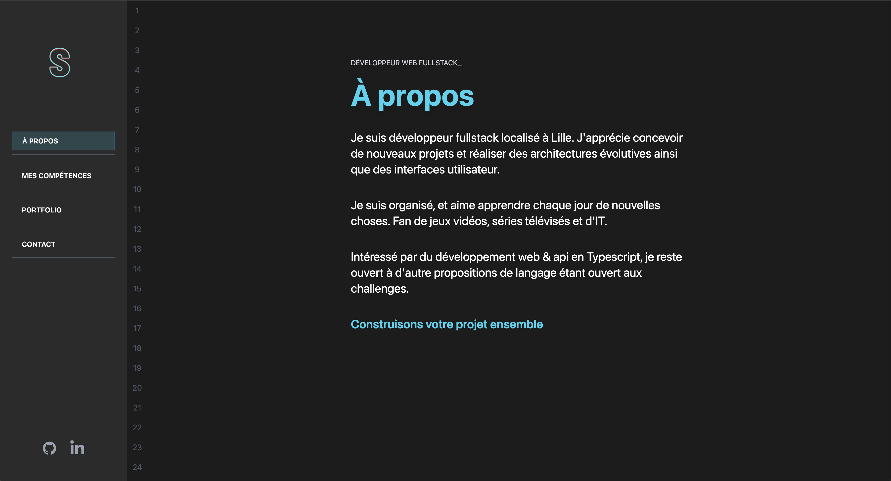
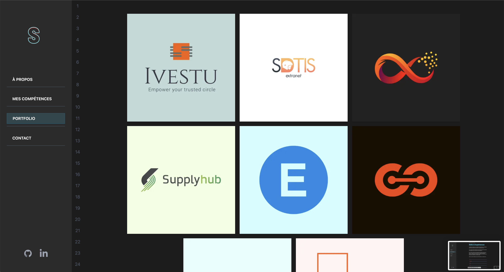
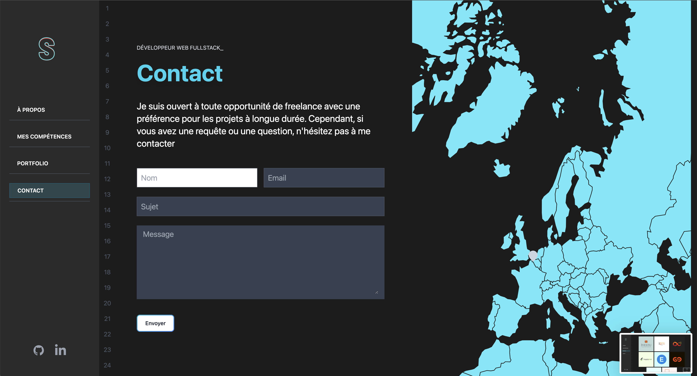

# 💻 Personal Portfolio in IDE Style

This project is a **personal portfolio site** made to look and feel like a real **code editor / IDE** interface.  
Built with **Next.js**, **TypeScript**, and **Tailwind CSS**, it showcases key sections such as:

- 📄 About Me
- ⚙️ Skills
- 🧱 Projects
- 📬 Contact Form

---

## 🎯 Goals

The aim is to provide a fun, developer-centric showcase that mimics a coding environment, reflecting both personality and technical skill.

---

## 🧰 Tech Stack

| Layer     | Technologies                          |
|-----------|----------------------------------------|
| Framework | [Next.js](https://nextjs.org/)         |
| Language  | [TypeScript](https://www.typescriptlang.org/) |
| Styling   | [Tailwind CSS](https://tailwindcss.com/) |
| Email     | Contact form powered via SMTP (configurable in `.env`)

---

## 🖼️ Features

- 🖥️ IDE-style layout and terminal look & feel
- 📱 Fully responsive design
- 🔧 Fully configurable content (skills, projects, text)
- ✉️ Working contact form with SMTP backend
- ⚡ Fast and lightweight

---

## 🚀 Getting Started

```bash
npm install
npm run dev
```

Then open [http://localhost:3000](http://localhost:3000) in your browser.

---

## 📬 Contact Form Setup

Create a `.env.local` file in the root and set:

```env
SMTP_HOST=smtp.example.com
SMTP_PORT=465
SMTP_USER=your_username
SMTP_PASSWORD=your_password
SMTP_FROM_EMAIL=you@example.com
```

> The contact form uses [nodemailer](https://nodemailer.com/) to send emails.

---

## 📸 Screenshots

### 🏠 About


### 👤 Skills Section


### 🧱 Projects Showcase


### ✉️ Contact Form


---

## 👨‍💻 Author

Crafted by [Sabri Ouaked](https://www.linkedin.com/in/sabri-ouaked/) with 💻 and ❤️  
[](https://github.com/ouakeds)

---

## 📄 License

MIT License — Free to use, modify and share.
